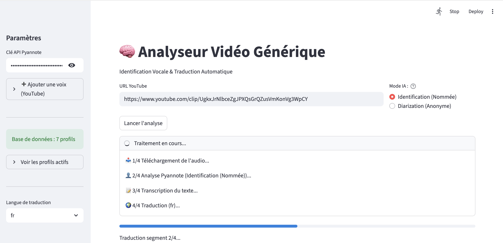

# Youtube-Auto-Subtitler

**Une application IA complète pour l'analyse, la transcription et la traduction de vidéos YouTube.**

Ce projet est une interface **Streamlit** qui automatise le pipeline de traitement vidéo en utilisant plusieurs modèles d'Intelligence Artificielle de pointe. Il permet de passer d'une simple URL YouTube à une vidéo entièrement sous-titrée et traduite, avec identification des interlocuteurs.

## Fonctionnalités Principales

* **Téléchargement YouTube** : Extraction automatique de l'audio et de la vidéo depuis une URL.
* **Identification Vocale (2 Modes)** :
    * **Mode Diarization** : Distingue les voix anonymement ("Intervenant 01", "Intervenant 02"...).
    * **Mode Identification** : Reconnait des personnes spécifiques (ex: "Federer", "Djokovic") grâce à une base de données d'empreintes vocales (Voiceprints).
* **Transcription Haute Précision** : Utilise le modèle **OpenAI Whisper** pour convertir la parole en texte.
* **Traduction Automatique** : Traduit instantanément les sous-titres vers le Français, Anglais, Espagnol, Allemand ou Italien.
* **Génération de Vidéo** : Crée un fichier `.mp4` final avec les sous-titres incrustés (hardcoded), prêt à être partagé.
* **Export de Données** : Téléchargement des transcriptions au format CSV.


---

## Prérequis

L'application nécessite impérativement les éléments suivants pour fonctionner :

1.  **FFmpeg** : Doit être installé et accessible via le PATH système. Il est utilisé pour l'extraction audio et le rendu vidéo final.
    * *Windows/Mac/Linux* : [Site officiel FFmpeg](https://ffmpeg.org/download.html).
2.  **Clé API Pyannote** : Requise pour l'accès aux modèles de diarisation et d'empreinte vocale (disponible sur [console.pyannote.ai](https://console.pyannote.ai)).

---

## Installation

```bash

# Installer les dépendances (environnement virtuel recommandé)
pip install -r requirements.txt

# Lancer l'interface
streamlit run app.py
```

## Structure du projet

```text
Youtube-Auto-Subtitler
│                    
├── app/
│   ├── app.py              # Interface principale Streamlit + orchestration
│   ├── diarization.py      # Gestion Pyannote : upload, diarisation, identification
│   ├── voiceprint.py       # Extraction & gestion des empreintes vocales
│   ├── transcript.py       # Transcription audio (Whisper local)
│   ├── translate.py        # Traduction via deep-translator
│   └── final_video.py      # Génération vidéo + incrustation des sous-titres (FFmpeg)
│
├── fig/ 
├── voice_database.json     # Base locale de voiceprints
├── requirements.txt        # Dépendances du projet
└── results/                # Exemples de sorties finales

```


## Utilisation

Pour lancer l'application :

```bash
streamlit run app/app.py
```

Dans l'interface Streamlit :

1. **Renseignez votre clé API Pyannote** dans la barre latérale.
2. **Collez l’URL de la vidéo YouTube** que vous souhaitez analyser et sous-titrer.
3. L'application se charge du reste : extraction, transcription, traduction, identification vocale et génération de la vidéo finale.
4. **(Optionnel)** Pour activer l’**identification de personnes spécifiques**, vous pouvez enrichir la base de données vocale via la section *Voiceprinting* (barre latérale gauche). Il suffit de fournir une vidéo YouTube dans laquelle la personne cible parle distinctement ; l’application extraira automatiquement son empreinte vocale et l’ajoutera à la base.

---

## Aperçu visuel

<p align="center">
  
</p>

